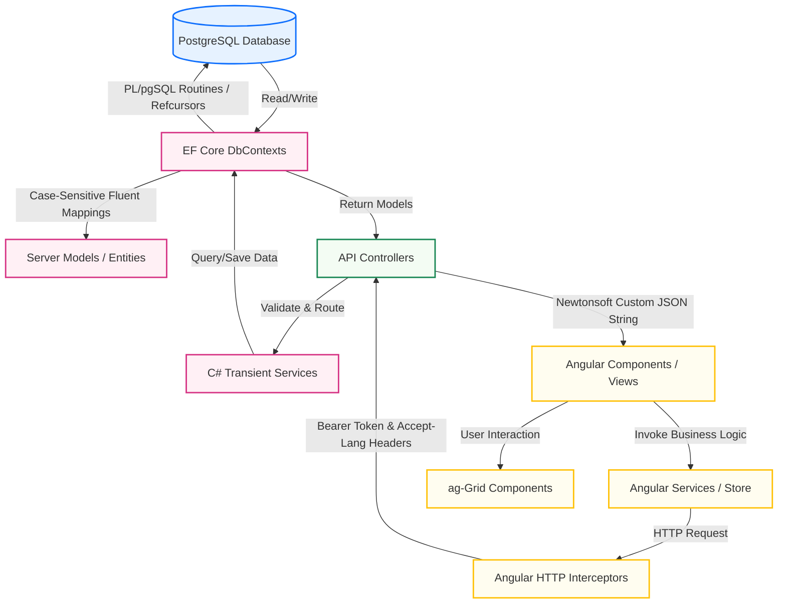

# DsfEMR: Architectural Maintenance Guide & Dependency Directory

This document serves as the authoritative technical reference for maintaining, extending, and debugging the Dsf EMR application. It details the system architecture, PostgreSQL database mapping standards, modern UI styling overrides, and language localization systems.

---

## 1. High-Level Architectural Diagram

Below is the dependency map representing how data flows from the frontend views through to the PostgreSQL relational storage engine.



---

## 2. PostgreSQL Database Migration Standards

Following the database engine migration from Microsoft SQL Server to PostgreSQL, the following practices are strictly enforced to maintain compatibility and prevent runtime exceptions.

### A. Case Sensitivity Rules
PostgreSQL treats all unquoted table and column names as lowercase. Since the original SQL Server schema used case-sensitive camelCase and PascalCase naming (e.g., `PatientId`, `BedID`, `WardID`), the DalLayer and all PL/pgSQL procedures must adhere to the following rules:

1. **Entity Mappings (Fluent API)**:
   For models where property names do not match database casing precisely, use the `.HasColumnName()` mapping inside `OnModelCreating()` of `MasterDbContext.cs` or `CoreDbContext.cs`:
   ```csharp
   modelBuilder.Entity<LookupsModel>().Property(x => x.LookupId).HasColumnName("LookUpId");
   ```
2. **Model Annotations**:
   Annotate property keys with explicit PostgreSQL casing using the `[Column]` attribute to cover implicit joins and contexts:
   ```csharp
   [Column("BedID")]
   public int BedId { get; set; }
   ```
3. **Double Quoting in SQL Queries**:
   When writing raw SQL or stored procedures, double-quote all case-sensitive identifiers:
   ```sql
   SELECT "PatientId", "BedCode" FROM "ADT_Bed" WHERE "WardID" = $1;
   ```

### B. PostgreSQL PL/pgSQL Procedures Directory
All stored procedures were converted into PL/pgSQL database functions. Below is the directory of functions critical to EMR modules:

| Original MSSQL Procedure | PostgreSQL PL/pgSQL Function | Output / Strategy |
| :--- | :--- | :--- |
| `SP_PHRM_GetDispensaryAvailableStock` | `sp_phrm_getdispensaryavailablestock` | Returns in-stock items, prices, narcotics flags, and VAT settings. |
| `sp_BedInformation` | `sp_bedinformation` | Returns two custom cursor sets (`ref1` count, `ref2` detailed patient list). |
| `SP_Report_BILL_CounterNUsersCollectionDaily` | `sp_report_bill_counternuserscollectiondaily` | Multi-table dataset via cursors (counter collections and user cash summaries). |
| `SP_APPT_PatientListForNewVisit` | `sp_appt_patientlistfornewvisit` | Returns a filtered cursor matching hospital index search strings. |
| `SP_OutPatient_Provisional_Items_List` | `sp_outpatient_provisional_items_list` | Retrieves pending transactions and outstanding invoice entries. |
| `SP_ADT_GetAllAdmittedPatients` | `sp_adt_getalladmittedpatients` | Dynamic admissions list joined to Ward and Bed tables. |
| `SP_BIL_GetBillTxnItemsBetnDaterange_ForDepartment` | `sp_bil_getbilltxnitemsbetndaterange_fordepartment` | Queries billable items by department with `ReturnStatus` checks. |

---

## 3. C# Backend Modernizations (.NET 8 Compatibility)

### A. Kestrel Synchronous I/O Block Fix
In .NET 8, asynchronous I/O is enforced by default. To support historical synchronous methods (e.g. legacy model serialization), the following global configurations are registered in `Startup.cs`:
```csharp
services.Configure<Microsoft.AspNetCore.Server.Kestrel.Core.KestrelServerOptions>(options =>
{
    options.AllowSynchronousIO = true;
});
services.Configure<Microsoft.AspNetCore.Builder.IISServerOptions>(options =>
{
    options.AllowSynchronousIO = true;
});
```

### B. Newtonsoft Response Serialization
To avoid circular references and nested empty array results `[]` when System.Text.Json encounters NewtonSoft structures (like `JObject` or `JArray`), all MVC controllers inherit `FormatResponse` from `CommonController` which serializes payloads explicitly and returns a `ContentResult`:
```csharp
protected ActionResult FormatResponse<T>(DsfHTTPResponse<T> responseData)
{
    string jsonStr = DsfJSONConvert.SerializeObject(responseData, true);
    return Content(jsonStr, "application/json");
}
```

---

## 4. Multi-Language i18n & Dynamic Menu Translations

### A. Header Propagation (Interceptor)
The `TokenInterceptorService` in [token-interceptor.service.ts](file:///Users/macbbook/SourceCodes/hospital-management-emr/Frontend/src/app/shared/token-interceptor/token-interceptor.service.ts) extracts the currently selected language from local storage and injects it as the `Accept-Language` header into every outgoing HTTP request:
```typescript
const selectedLanguage = localStorage.getItem('selected_language') || 'en';
const authReq = req.clone({
  setHeaders: {
    'Accept-Language': selectedLanguage
  }
});
```

### B. Database-Backed Route Localization
The EMR sidebar menu loads dynamically from the `"RBAC_RouteConfig"` table. The database contains localized displayName columns (e.g., `DisplayName_vi`).
When an API request arrives with `Accept-Language: vi`, the [SecurityController.cs](file:///Users/macbbook/SourceCodes/hospital-management-emr/Code/Websites/DsfEMR/Controllers/Security/SecurityController.cs) runs a recursive localized mapper:
```csharp
if (lang == "vi" && !string.IsNullOrEmpty(route.DisplayName_vi))
{
    route.DisplayName = route.DisplayName_vi;
}
```
This serves fully localized routes to the Angular frontend dynamically, with **zero modifications** needed in Angular HTML templates.

---

## 5. ag-Grid Pagination Styling (v31+ & Legacy Compatibility)

Modern ag-Grid versions (v28+) dropped the `-panel` suffix from inner pagination CSS classes, resulting in unstyled custom elements (`.ag-select` and `.ag-picker-field` divs) displaying as block-level blocks, wrapping the page size labels and stretching navigation buttons into thick stacked lines.

The robust horizontal layout overrides are implemented in:
* [grid-style-new.css](file:///Users/macbbook/SourceCodes/hospital-management-emr/Frontend/src/themes/theme-default/grid-style-new.css)
* [DsfStyle.css](file:///Users/macbbook/SourceCodes/hospital-management-emr/Frontend/src/themes/theme-default/DsfStyle.css)
* [grid-style.css](file:///Users/macbbook/SourceCodes/hospital-management-emr/Frontend/src/themes/theme-default/grid-style.css)

### Unified CSS Rules Rulebook
```css
/* Core Flex Container */
.ag-theme-fresh .ag-paging-panel {
    display: flex !important;
    flex-direction: row !important;
    flex-wrap: nowrap !important;
    align-items: center !important;
    justify-content: space-between !important;
    height: 48px !important;
    padding: 0 16px !important;
    background-color: #f6f6f6 !important;
    box-sizing: border-box !important;
}

/* Align sub-components (Page Size, Row Summary, Page Navigation) */
.ag-theme-fresh .ag-paging-panel .ag-paging-page-size-panel,
.ag-theme-fresh .ag-paging-panel .ag-paging-page-size,
.ag-theme-fresh .ag-paging-panel .ag-paging-row-summary-panel,
.ag-theme-fresh .ag-paging-panel .ag-paging-row-summary,
.ag-theme-fresh .ag-paging-panel .ag-paging-page-summary-panel,
.ag-theme-fresh .ag-paging-panel .ag-paging-page-summary {
    display: inline-flex !important;
    flex-direction: row !important;
    flex-wrap: nowrap !important;
    align-items: center !important;
    gap: 8px !important;
    width: auto !important;
}

/* Force all child nodes of sub-panels to flow horizontally and ignore block overrides */
.ag-theme-fresh .ag-paging-panel .ag-paging-page-size-panel *,
.ag-theme-fresh .ag-paging-panel .ag-paging-page-size *,
.ag-theme-fresh .ag-paging-panel .ag-paging-page-summary-panel *,
.ag-theme-fresh .ag-paging-panel .ag-paging-page-summary * {
    display: inline-flex !important;
    flex-direction: row !important;
    align-items: center !important;
    white-space: nowrap !important;
    width: auto !important;
}

/* Standard Button Sizes */
.ag-theme-fresh .ag-paging-panel button,
.ag-theme-fresh .ag-paging-panel .ag-paging-button {
    display: inline-flex !important;
    align-items: center !important;
    justify-content: center !important;
    min-width: 32px !important;
    height: 28px !important;
    padding: 0 10px !important;
    background-color: #0772bc !important;
    border: 1px solid #0569ad !important;
    color: #fff !important;
    border-radius: 4px !important;
}

/* Custom Dropdown select size */
.ag-theme-fresh .ag-paging-panel select,
.ag-theme-fresh .ag-paging-panel .ag-select,
.ag-theme-fresh .ag-paging-panel .ag-picker-field {
    display: inline-flex !important;
    align-items: center !important;
    min-width: 50px !important;
    height: 28px !important;
    border: 1px solid #ccc !important;
    border-radius: 4px !important;
}
```

---

## 6. Static Asset Links Directory (`wwwroot` Serving)
At development and build time, the backend ASP.NET Core views depend on styles located in `Frontend/src/`. To avoid manual file copies, the backend directories are linked directly via filesystem symlinks:
* `/Code/Websites/DsfEMR/wwwroot/themes` ──► `/Frontend/src/themes`
* `/Code/Websites/DsfEMR/wwwroot/assets` ──► `/Frontend/src/assets`
* `/Code/Websites/DsfEMR/wwwroot/assets-dph` ──► `/Frontend/src/assets-dph`

*Note: In production IIS, these are mapped as Virtual Directories matching the same names.*
